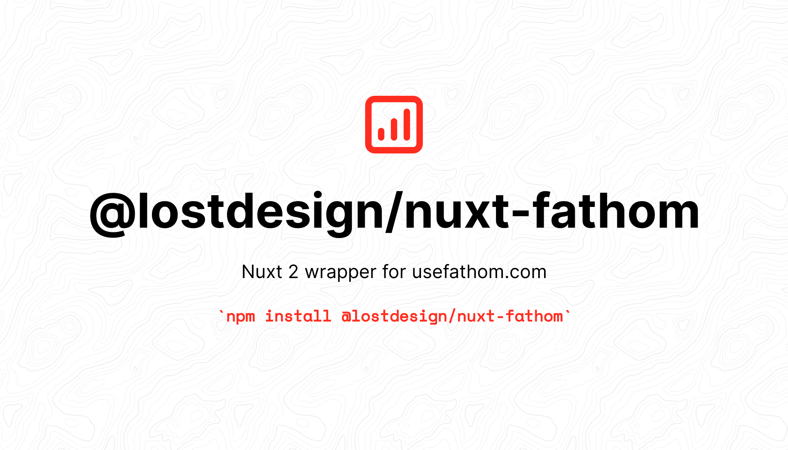

<p align="center">
  
</p>

This package is a nuxt 2 wrapper around [derrickreimer/fathom-client](https://github.com/derrickreimer/fathom-client) to be able to use [usefathom.com](https://usefathom.com) in all its glory. Thanks to @derrickreimer for this framework agnostic library ❤️‍🔥.

## 🔧 Installation
#### 1. Install the following packages:
```
npm i fathom-client
npm i @lostdesign/nuxt-fathom
```

#### 2. Register the module inside `nuxt.config.js`
```js
export default {
  ...
  modules: ['@lostdesign/nuxt-fathom']
  ...
}
```

#### 3. Configure the module inside `nuxt.config.js`
```js
export default {
  ...
  fathom: {
    namespace: 'fathom', // optional
    spa: 'history', // recommended
    siteId: 'YOUR-SITE-ID-FROM-FATHOM',
    url: 'https://custom.fathom.domain.com/script.js'
    honorDNT: false,
    includedDomains: [
      'replace-with-your-domain.com',
      'localhost:3000',
      'uselinked.com'
    ],
    excludedDomains: [
      'google.com'
    ],
    canonical: true,
  },
  ...
}
```


| Property | Type | Required | Description |
| ------------- | ------------- | ------------- | ------------- |
| `siteId` | string | `mandatory` | The site id as given by fathom, find yours in your [usefathom settings](https://app.usefathom.com/#/settings/sites). |
| `spa` | string | `mandatory` | Accepts one of the following values: `auto`, `history`, or `hash` (see [advanced docs](https://usefathom.com/support/tracking-advanced)). |
| `includedDomains` | array | `optional` | Only tracks when on one of these domains. |
| `excludedDomains` | array | `optional` | Only tracks when NOT on one of these domains. |
| `url` | string | `optional` | The URL of the tracking script (defaults to `https://cdn.usefathom.com/script.js`). If you're using a [custom domain](https://usefathom.com/support/custom-domains) then you should change this parameter to use it (example `https://parrot.yourwebsite.com/script.js`). |
| `honorDNT` | boolean | `optional` | When `true`, honors the [DNT header](https://developer.mozilla.org/en-US/docs/Web/HTTP/Headers/DNT) in the visitor's browser |
| `canonical` | boolean | `optional` | When `false`, ignores the canonical tag if present (defaults to `true`). |
| `namespace` | string | `optional` | Optional value to overwrite the default namespace of fathom. Default is `fathom` which means you will be able to use `this.$fathom.trackPageview()`. |

#### 4. Optional: Register global trackPageview middleware inside `nuxt.config.js`
Every pageview will be *automatically tracked* if you register this middleware. Without you are **required** to call `this.$fathom.trackPageview()` yourself, most likely inside a custom page middleware.
```js
export default {
  ...
  router: {
    middleware: ['fathom']
  }
  ...
}
```

## 📚 Usage
#### `this.$fathom.trackPageview(opts?: object)`

Tracks a pageview.

##### Arguments

- `opts` - An Object of options:
  - `url` - When set, overrides `window.location`.
  - `referrer` - When set, overrides `document.referrer`.


#### `this.$fathom.trackGoal(code: string, cents: number)`

Tracks a goal.

##### Arguments

- `code` - the code provided in the Fathom UI.
- `cents` - the value of the goal conversion.


#### `this.$fathom.enableTrackingForMe()`

Enables tracking for the current visitor.

See https://usefathom.com/docs/features/exclude.


#### `this.$fathom.blockTrackingForMe()`

Blocks tracking for the current visitor.

See https://usefathom.com/docs/features/exclude.


#### `this.$fathom.setSite(id: string)`

Sets the site ID for tracking (overrides the ID used when loading Fathom).

##### Arguments

- `id` - The site ID provided in the Fathom UI.

See [advanced options for tracking](https://usefathom.com/support/tracking-advanced).


# 💖 Sponsor

If you enjoy the this package, please consider [becoming a sponsor or leave a tip](https://github.com/sponsors/lostdesign) or use my referral link for [https://usefathom.com/ref/MQYHPK](https://usefathom.com/ref/MQYHPK) when signing up for fathom ❤️‍🔥.